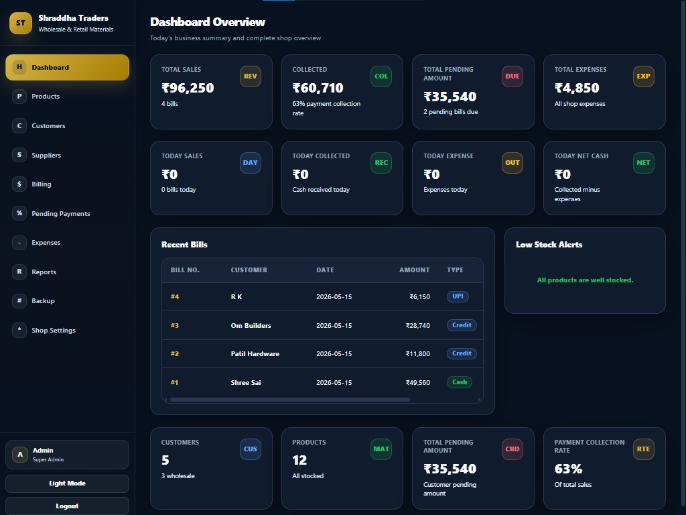
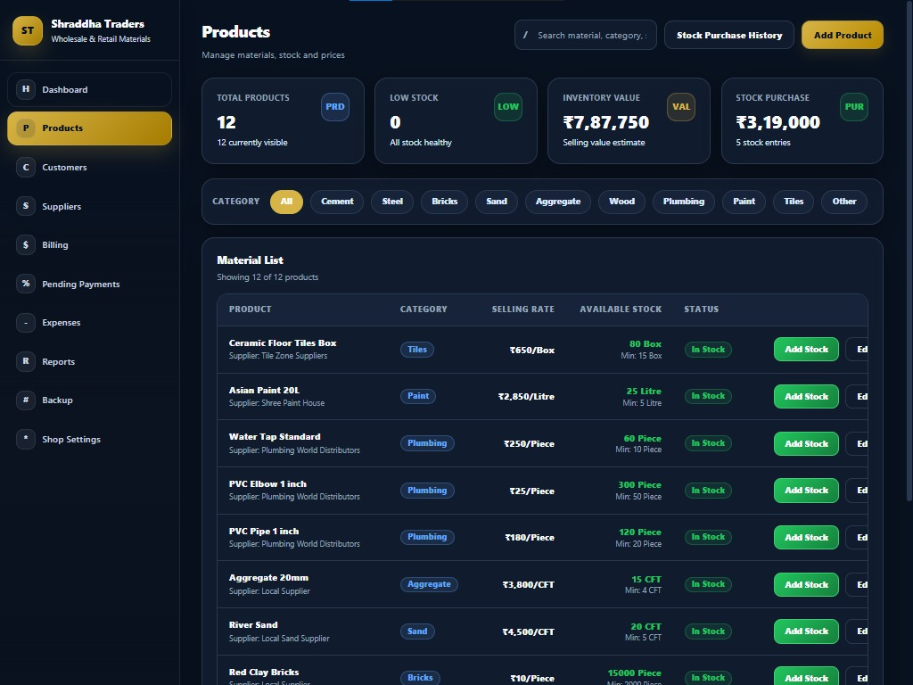
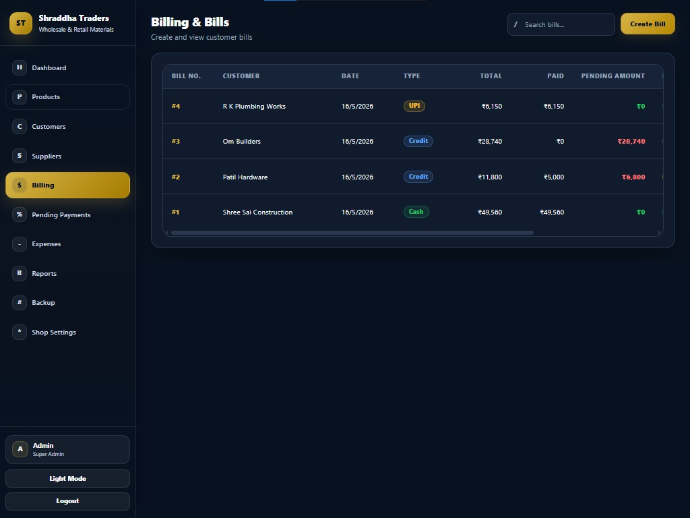
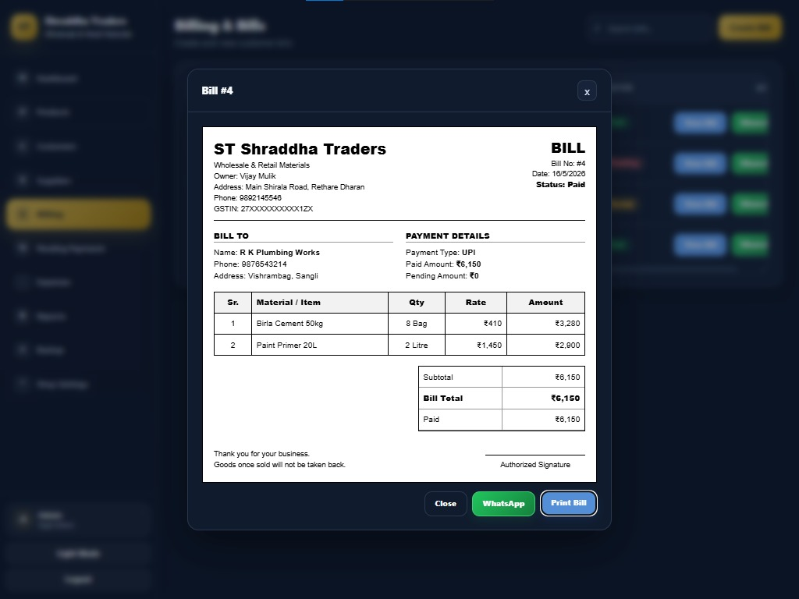
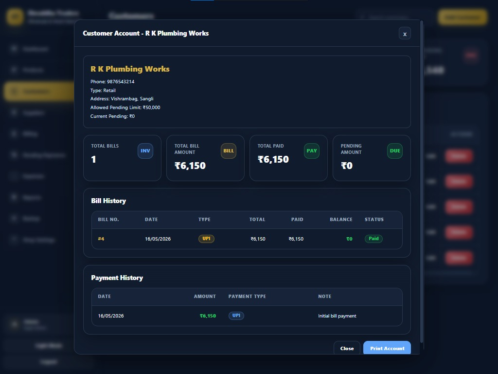
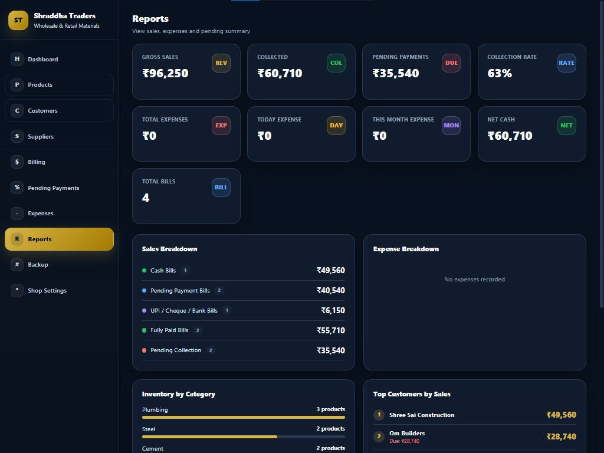

# Building Material Shop Management System

A real-world full-stack shop management system built for building material, hardware, and construction material businesses.

This project helps shop owners manage products, stock, customers, suppliers, billing, pending payments, customer account/ledger, expenses, reports, backup, and shop settings.

## Features

- Dashboard with business overview
- Product and stock management
- Add stock and stock history
- Customer management
- Supplier management
- Billing and bill printing
- Pending payment / credit management
- Customer account / ledger with print
- Daily expenses management
- Reports and business analytics
- Backup system
- Shop settings
- Light and dark theme
- Professional print design for bills and customer account
- MySQL database integration
- REST API backend

## Tech Stack

**Frontend**
- React.js
- CSS
- Vite

**Backend**
- Node.js
- Express.js
- MySQL
- REST API

**Database**
- MySQL

## Project Structure

```txt
shraddha-traders-app/
│
├── backend/
│   ├── config/
│   ├── routes/
│   ├── server.js
│   └── package.json
│
├── frontend/
│   ├── src/
│   │   ├── components/
│   │   ├── context/
│   │   ├── pages/
│   │   ├── utils/
│   │   └── App.jsx
│   └── package.json
│
└── README.md
## Screenshots

### Dashboard


### Products


### Billing


### Bill Invoice


### Customer Account


### Reports
